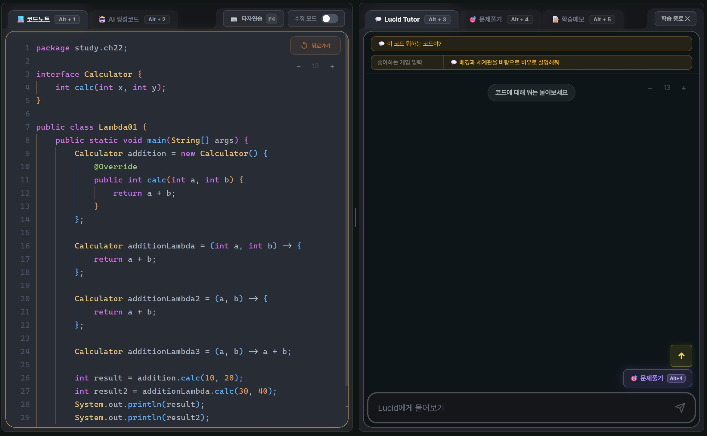

# 💎 Lucid (루시드)
> **"고요한 몰입, 선명한 이해"** — 집중력을 지키고 데이터로 소통하는 AI 기반 올인원 학습 플랫폼

  

## 🚀 프로젝트 배경 (Problem & Solution)
현대 교육 현장은 AI 덕분에 정답을 얻기는 쉬워졌으나, 학생이 무엇을 모르는지 강사가 파악하기 어려운 **'데이터 단절'** 현상을 겪고 있습니다. 

**Lucid**는 듀오링고(Duolingo)의 게이미피케이션 모델을 벤치마킹하여, 파편화된 학습 도구를 하나로 통합하고 학습 행위를 실시간 데이터로 전환합니다. 이를 통해 학생에게는 **몰입**을, 강사에게는 **데이터 기반의 선제적 관리**를 제공합니다.

---

## ✨ 핵심 시스템: 마스터 노트 (Master Note)
사용자의 집중력을 빼앗는 '도구 전환(Tab Switching)'을 최소화하기 위해 크롬 인터페이스 기반의 올인원 환경을 구축했습니다.

### 1. 코드 연동 및 AI 튜터링
| 기능 | 상세 설명 | 관련 화면 |
| :--- | :--- | :--- |
| **코드 노트** (`Alt+1`) | 강사의 GitHub 레포지토리와 실시간 연동하여 수업 내용을 즉시 복습/예습합니다. |  |
| **Lucid Tutor** (`Alt+3`) | 코드 맥락을 이해하는 AI가 정답 대신 비유와 힌트로 사고를 유도합니다. |  |
| **AI 생성 코드** (`Alt+2`) | 기존 코드를 **쉬움/보통/어려움** 난이도로 재구성하여 수준별 단계 학습을 지원합니다. |  |

### 2. 실전 연습 및 기록
| 기능 | 상세 설명 | 관련 화면 |
| :--- | :--- | :--- |
| **문제 풀기** (`Alt+4`) | 학습 중인 코드에서 AI가 실시간 문제를 출제합니다. 오답 시 하트가 소모되며 힌트가 제공됩니다. |  |
| **학습 메모** (`Alt+5`) | 노션 스타일 마크다운 필기 도구입니다. 작성된 내용은 PDF 및 MD 파일로 추출 가능합니다. |  |
| **타자 연습** (`F4`) | 소스 코드를 활용한 영문 타자 연습을 통해 실전 코딩 감각을 익히고 전용 뱃지를 획득합니다. | (상세 구현 완료) |

---

## 🎮 게이미피케이션 & 보상 체계
학습을 '지루한 노동'에서 '즐거운 채굴'로 프레이밍하여 강력한 동기부여를 제공합니다.

  

### 🫘 원두 채굴 시스템 (Reward Logic)
- **컨셉**: "공부하러 가자" 대신 **"원두 채굴하러 가자"**는 심리적 프레이밍 적용.
- **드랍 룰**: 일일 퀘스트 전체 클리어 시 **23% 확률**로 원두 드랍 (기수 110일 기준 평균 25개 획득 설계).
- **오프라인 연동**: 원두 5개를 모으면 멘토에게 커피로 교환. 자연스러운 면담과 격려의 기회 창출.

### 🏆 실력 지표의 이원화 (XP vs LP)
- **XP (성실성 보상)**: 모든 학습 활동에서 적립되며, 커피 교환 및 아이템 획득에 사용.
- **LP (실력 지표)**: '문제지옥' 등 실력 측정 모드에서만 쌓이며 과목별 티어(브론즈~다이아) 결정.

---

## 👨‍🏫 강사 및 관리자 전용 기능 (Admin)
- **시각적 자리배치도**: 학생의 실력을 뱃지(입문/경험/전공)로 표시하여 효율적인 학습 지도가 가능합니다.
- **이탈 방지 알림**: 접속 데이터가 멀어지는 학생을 '적신호'로 감지하여 강사가 선제적으로 상담을 주도하도록 돕습니다.

---

## 🗓 구현 예정 사항 (Roadmap)

### 1. 퀘스트 시스템 (Daily Quest)
- 단순 루틴이 아닌, 30분 분량의 무게감 있는 **4단계 미션**으로 구성.
- 미션 1(진입 마찰 최소화) → 미션 4(보상 극대화) 구조로 "하나만 더" 심리 유도.

### 2. 문제지옥 (Infinite Challenge) & 배치고사
- **배치고사**: 최초 진입 시 10문항으로 사용자 티어를 결정하고 학습 난이도 커스터마이징.
- **문제지옥**: Java, React 등 과목별 실력을 무한으로 검증하여 계급을 쌓는 랭킹 시스템.

### 3. 시즌 시스템 (2-Month Season)
- 2개월 단위 시즌 리셋을 통해 지속적인 긴장감과 "다시 쌓아가는 맛" 제공.
- 시즌 종료 시 최종 티어는 프로필에 기록(박제)하여 명예욕 고취.

---

## 🛠 기술 스택 (Tech Stack)
- **Frontend**: React + Vite + TailwindCSS
- **Editor**: Monaco Editor
- **AI Engine**: **Gemini 2.5 Flash-Lite**, **GPT-4o**
- **Infrastructure**: Firebase (Auth, Firestore), Vercel

---
**Developer**: 최혁준
**Project**: 제1회 K.I.T. 바이브코딩 공모전 출품작